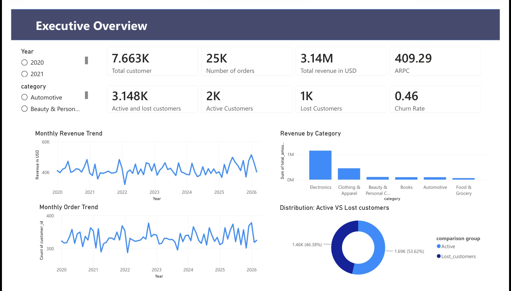

# Customer Retention & Churn Driver Analysis with Churn-Associated Product Identification

> An end-to-end customer retention analysis using Python, Excel, statistical testing, and Power BI to understand customer churn, prioritize retention efforts, and identify products that may require further business investigation.

---

# Project Overview

Keeping existing customers is usually much cheaper than acquiring new ones. Because of that, customer retention is one of the most important business problems for most e-commerce companies.

In this project, I explored customer retention from both customer and product perspectives. Instead of building a churn prediction model, the goal is to understand how customers behave, identify which customer groups should be prioritized, investigate possible churn drivers, and flag products that appear disproportionately among churn-prone customers.

The project combines Python, Excel, statistical hypothesis testing, and Power BI into a single business-oriented analytics workflow.

The project is organized into three parts:

1. Business Problem & Workflow
2. Methodology
3. Business Findings & Conclusion

---

# Table of Contents

- Part I : Business Problem & Workflow
- Part II : Methodology
- Part III : Business Findings & Conclusion

---

# Part I : Business Problem & Workflow

## Business Problem

This project tries to answer four practical business questions related to customer retention.

Instead of only describing customer behaviour, the analysis focuses on producing findings that can support future marketing, customer retention, and product decisions.

The main objectives are to

- Understand overall customer retention behaviour
- Identify customer groups that should be prioritized
- Investigate potential churn drivers
- Identify products associated with customer churn

---

## Business Questions

### 1. How does customer retention behave?

The first step is understanding the overall retention performance of the business.

Questions answered in this section include

- What is the overall customer churn rate?
- Which acquisition cohorts perform poorly?
- When do customers typically leave?
- How are customers distributed across different retention segments?
- What do the overall business KPIs look like?

---

### 2. Which customers should be prioritized?

Not every customer should receive the same retention strategy.

Customers are segmented using RFM analysis to identify business-oriented customer groups, including

- VIP Customers
- Cannot Lose Customers
- At Risk Customers
- Low Engagement Customers
- Lost Customers

These groups are later used to prioritize retention campaigns and business resources.

---

### 3. What factors are related to customer churn?

Several business hypotheses are tested to see whether customer groups behave differently.

The analysis compares customer groups based on

- Purchase amount
- Discount amount
- Shipping fee
- Shipping waiting time
- Product-page engagement

Instead of relying on assumptions, every hypothesis is evaluated using an independent two-sample t-test.

---

### 4. Which products are associated with customer churn?

Besides customer behaviour, this project also investigates products.

Some products appear much more frequently among churn-prone customers than others. Those products are flagged as **Churn-associated Products** and become candidates for further business investigation.

Products that appear more frequently among retained customers are classified as **Retention-friendly Products** and may be considered for future marketing exposure.

The objective is not to prove causality, but to generate a practical shortlist for future product quality reviews and business decisions.

---

## Dataset

| Item | Description |
|------|-------------|
| Business Domain | E-commerce |
| Observation Unit | Order ID |
| Time Period | 2021–2026 |
| Analysis Tools | Python, Excel, Power BI |
| Python Libraries | Pandas, NumPy, SciPy, Matplotlib |

---

## Analytical Workflow

```text
Raw Transaction Data
│
▼
Data Cleaning & Processing
│
▼
Business Overview
│
▼
Cohort Analysis
│
▼
RFM Analysis
│
▼
Customer Segmentation
│
▼
Group Analysis
│
▼
Statistical Hypothesis Testing
│
▼
Product Investigation
│
▼
Business Insights
│
▼
Power BI Dashboard
```

---

# Part II : Methodology

## Data Cleaning & Processing

The project starts with cleaning and preparing the transaction data before any analysis is performed.

The preprocessing stage includes

- Handling missing values
- Correcting data types
- Removing inconsistent records
- Creating derived variables
- Preparing customer-level features for downstream analysis

---

## Business Overview

A general business overview is created before moving into customer-level analysis.

This section summarizes

- Revenue
- Orders
- Customers
- Product categories
- Payment methods
- Monthly business trends
- Core business KPIs

The purpose is to understand the overall structure of the business before investigating retention behaviour.

---

## Cohort Analysis

Cohort analysis is used to measure customer retention over time and compare acquisition cohorts.

The analysis focuses on

- Customer retention by cohort
- Cohort lifetime
- Retention curves
- Cohort performance comparison

The cohort calculation was implemented in Python and independently verified in Microsoft Excel as a validation step.

---

## RFM Analysis

Customer value is measured using the Recency, Frequency, and Monetary (RFM) framework.

Each customer receives an RFM score that is later used for customer segmentation.

---

## Customer Segmentation

Customers are grouped into business-oriented segments based on their RFM scores.

The segmentation includes

- VIP
- Cannot Lose
- At Risk
- Low Engagement
- Lost

These segments become the foundation for all subsequent analyses.

---

## Group Analysis

After segmentation, customer groups are compared across multiple dimensions.

This includes

- Product category preference
- Payment method
- Purchase behaviour
- Correlation between RFM variables

The objective is to identify behavioural differences between customer groups.

---

## Statistical Hypothesis Testing

Several business hypotheses are tested using independent two-sample t-tests.

The variables tested include

- Purchase amount
- Discount amount
- Shipping fee
- Shipping waiting time
- Product-page engagement

The goal is to determine whether the observed differences between customer groups are statistically significant rather than random variation.

---

## Product Investigation

The final analysis shifts from customer-level behaviour to product-level behaviour.

Products are compared across customer segments to identify

- Churn-associated Products
- Retention-friendly Products

These products are not interpreted as direct causes of customer churn.

Instead, they serve as practical candidates for future product quality investigation, customer feedback analysis, and business intervention
# Part III: Business Findings and Conclusion

## Dashboard

The dashboard summarizes the main findings of this project, including customer segmentation, cohort retention, product analysis, hypothesis testing, and overall business KPIs.



---

# Business Insights

## Customer Prioritization

Customer retention should not be treated equally across all customer groups.

- Cannot Lose and At Risk customers contribute the highest potential revenue loss and should be prioritized.
- Low Engagement customers account for almost half of all customers, suggesting many users leave before becoming loyal customers.
- Different customer groups require different retention strategies.

---

## Early Customer Drop-off

More than 90% of customers become inactive after their first month across almost every cohort.

This indicates that the biggest retention challenge happens immediately after the first purchase rather than later in the customer lifecycle.

---

## Churn Drivers

Purchase amount shows a statistically significant difference between customer groups.

However, no significant difference was found for

- Discount amount
- Shipping fee
- Waiting time
- Session duration

The current dataset is therefore not sufficient to fully explain why customers churn. Other factors such as product quality, customer satisfaction, and competitor offerings should be investigated.

---

## Product Investigation

Several products were identified as churn-associated products.

These products should not be considered as the direct cause of churn, but as candidates for further investigation.

One notable finding is that At Risk customers purchase Clothes & Apparel significantly more often than other customer groups. This category may deserve additional quality or customer feedback reviews.

Retention-friendly products were also identified and may be considered for higher marketing exposure.

---

## Revenue Performance

Monthly revenue and order volume fluctuate over time but remain relatively stable overall.

Revenue peaks and order peaks occur during the same periods, suggesting that sales performance is mainly driven by order volume.

---

# Business Recommendations

## Customer Strategy

Focus retention resources on customer groups with the highest business impact.

- Cannot Lose → Immediate retention campaign
- At Risk → Personalized retention offers
- VIP → Loyalty and premium benefits
- Low Engagement → Re-engagement campaign
- Lost Customer → Win-back campaign (when economically feasible)

---

## Early-stage Retention

Most customers leave after their first month.

Retention efforts should therefore focus on the first 30 days after acquisition.

Possible initiatives include

- Loyalty point programs
- Daily check-in rewards
- Gamification
- First-month exclusive offers
- Personalized recommendations

The objective is to encourage repeat purchases and build customer habits during the period with the highest drop-off.

---

## Product Strategy

Use churn-associated products as an early warning list.

Further investigation should include

- Product quality
- Return rate
- Customer reviews
- Customer complaints

Retention-friendly products may also be considered for increased exposure in future campaigns.

---

## Marketing Strategy

The analysis suggests that discount campaigns alone are unlikely to solve customer churn.

Future retention strategies should combine pricing with product quality improvements and better customer experience.

---

## Future Data Collection

To better understand customer churn, future datasets should include

- Customer satisfaction
- Product ratings
- Customer support interactions
- Return records
- Customer complaints
- Competitor information

---

# Limitations

This project identifies statistical relationships rather than causal relationships.

Some recommendations require additional operational data before business decisions can be made.

---

# Future Work

Possible extensions of this project include

- Customer Lifetime Value (CLV)
- Churn prediction model
- Survival analysis
- A/B testing for retention campaigns
- Personalized recommendation system
# Tools & Technologies

- Python
- Pandas
- NumPy
- SciPy
- Matplotlib
- Excel
- Power BI
- Git
- GitHub
